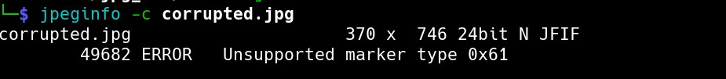

# Solver


# Challenge Name:  Bou3rada’s Bizarre Adventures 

## Category: Digital Forensics

## Description
Bou3rada,had his perfect JPEG portrait messed up and turned into a chaotic blob! But here’s the twist—he left a hidden message in the mess that you might be interested in. 

Can you fix the corruption and uncover the message?

---

## Approach
For this challenge we're presented with a corrupted jpeg image the goal is to fix it obviously.
First, let's check where the errors come from.




We're getting Image Marker errors : Unknown markers

Let's look up jpeg image markers

"A Marker provides you with a way to identify or label a spot within the processing pipeline. Adding a marker into the pipeline will allow you to refer to the image currently being processed at that point. It can also be used to specify a location in the pipeline for other modules."

eg : FF D8 (Start of the Image)

[Legit JPEG Markers](https://www.disktuna.com/list-of-jpeg-markers/)

You can find everything there now let's proceed with our solver.
The goal is to fix the undefined markers since we can't replace them with legit markers because we might trigger other errors
I believe the way to solve this is by replacing the undefined markers with the null marker "0x00".


## Solve

```python

JPEG_MARKERS_CLEAN = [marker & 0x00FF for marker in [
    0xFFD8,
    0xFFD9,
    
    
    0xFFE0, 0xFFE1, 0xFFE2, 0xFFE3, 0xFFE4, 0xFFE5, 0xFFE6, 0xFFE7,
    0xFFE8, 0xFFE9, 0xFFEA, 0xFFEB, 0xFFEC, 0xFFED, 0xFFEE, 0xFFEF,

   
    0xFFDB,
    0xFFC4,


    0xFFC0, 0xFFC1, 0xFFC2, 0xFFC3, 0xFFC5, 0xFFC6, 0xFFC7,
    0xFFC8, 0xFFC9, 0xFFCA, 0xFFCB, 0xFFCC, 0xFFCD, 0xFFCE, 0xFFCF,

    0xFFDA,


    0xFFD0, 0xFFD1, 0xFFD2, 0xFFD3, 0xFFD4, 0xFFD5, 0xFFD6, 0xFFD7,


    0xFFDD, 0xFFDE, 0xFFDF,

    0xFFFE
]]


def restore_jpeg_null_markers(input_file, output_file):
    with open(input_file, "rb") as f:
        data = bytearray(f.read())

    i = 0
    while i < len(data) - 1:
        if data[i] == 0xFF and data[i+1] not in JPEG_MARKERS_CLEAN :  
            print(data[i:i+2])
            data[i + 1] = 0x00
        i += 1

    with open(output_file, "wb") as f:
        f.write(data)

    print(f"Restored JPEG saved as '{output_file}'")


restore_jpeg_null_markers("corrupted.jpg", "restored.jpg")

```


**Flag** : **Spark{Bou3rada_9allek_R0mdhAn3k_m4broUK!!}**