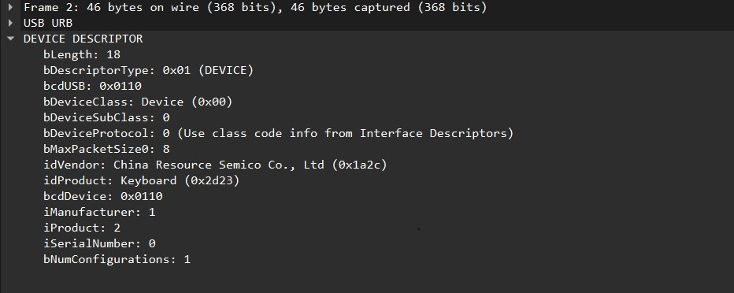

# Solver


# Challenge Name: Brainless

## Category: Digital Forensics

## Description
It all started when Graya plugged in a mysterious USB device.Five seconds later, his screen was flooded with a mess of random characters. Was it a ghost? A secret hacker message? Or just Graya’s laptop finally giving up on him?

Your job is to figure out what this possessed device was trying to say.

---

## Approach
For this challenge we're presented with a pcap file containing usb traffic 
first thing that comes to mind is to check what devices are generating those 
inputs
You can find this in the device descriptor section.



Hmmm,a keyboard and we also notice that the packets have a command field HID Data

Let's look it up

[HERE](https://www.kenkoonwong.com/blog/usb-hid-key-press-report/)

You can find everything there now let's extract the data:

```bash
tshark -r Some_Weird_Capture.pcap -T fields -e  "usbhid.data" -Y "usb.src== 2.2.1" > hiddata.hex

```

## Solve

```python

KEY_CODES = {
    0x04:['a', 'A'],
    0x05:['b', 'B'],
    0x06:['c', 'C'],
    0x07:['d', 'D'],
    0x08:['e', 'E'],
    0x09:['f', 'F'],
    0x0A:['g', 'G'],
    0x0B:['h', 'H'],
    0x0C:['i', 'I'],
    0x0D:['j', 'J'],
    0x0E:['k', 'K'],
    0x0F:['l', 'L'],
    0x10:['m', 'M'],
    0x11:['n', 'N'],
    0x12:['o', 'O'],
    0x13:['p', 'P'],
    0x14:['q', 'Q'],
    0x15:['r', 'R'],
    0x16:['s', 'S'],
    0x17:['t', 'T'],
    0x18:['u', 'U'],
    0x19:['v', 'V'],
    0x1A:['w', 'W'],
    0x1B:['x', 'X'],
    0x1C:['y', 'Y'],
    0x1D:['z', 'Z'],
    0x1E:['1', '!'],
    0x1F:['2', '@'],
    0x20:['3', '#'],
    0x21:['4', '$'],
    0x22:['5', '%'],
    0x23:['6', '^'],
    0x24:['7', '&'],
    0x25:['8', '*'],
    0x26:['9', '('],
    0x27:['0', ')'],
    0x28:['\n','\n'],
    0x29:['[ESC]','[ESC]'],
    0x2a:['[BACKSPACE]', '[BACKSPACE]'],
    0x2C:[' ', ' '],
    0x2D:['-', '_'],
    0x2E:['=', '+'],
    0x2F:['[', '{'],
    0x30:[']', '}'],
    0x32:['#','~'],
    0x33:[';', ':'],
    0x34:['\'', '"'],
    0x36:[',', '<'],
    0x37:['.', '>'],
    0x38:['/', '?'],
    0x2b:['\t','\t'],
    0x58: ["\n","\n"],

}


def read_use(file):
    with open(file, 'r') as f:
        datas = f.read().split('\n')
    datas = [d.strip() for d in datas if d] 
    output = ''
    for data in datas:
        shift = int(data[:2], 16) 
        key = int(data[4:6], 16)

        if shift != 0:
            shift = 1
        else :
            shift = 0
    
        
        if KEY_CODES[key][shift] == '\n':
            output += '\n'
        else:
            output += KEY_CODES[key][shift]

    return output


print(read_use("hiddata.hex"))


```
**Output**

```

A wild USB device has appeared! It seems to be saying something... but in a strange way :P

1


2


3


LOADING...........


IS THIS THING STILL GOING??


.......


!!!! KERNEL PANIC !!!!


CORE DUMPED X-X

XOXOOXOXOXOXOXOXOXOXOXOXOXOOXXXOXO
AHHHHH MY BRAIN CANT WITHSTAND THIS

++++++++++[>+>+++>+++++++>++++++++++<<<<-]>>>+++++++++++++.>++++++++++++.<++++++++++++++.>++.-------.++++++++++++++++. <--------------------------.<++++++++++++++++++..>>-----------------------.-----.<+++.>++++++++++++++++.-------------. ---.<--.<+++.>>++++.++++++++.<<.>>+++++++.-------------------.----------.++++++++++.<----.<.>>++++.<<---.>>+.<<+++. >>.-----.----------.--.<--.>++++++++++++.<++++++.<--.>----.>.<++++++++.<.>>++++++++++++.<<++.>>------------.<----------- .>.<+++++++++++++++.>+++++++++++++++++++.<<---.>>+++++++++++.

YOU KNOW WHAT TO DO
```
That's clearly Brainfuck you can use any interpreter online


**Flag** : **Spark{G00d_Job_H3ck3r_U_D3c0d3d_USB_H1D_L1k3_A_Pr0}**