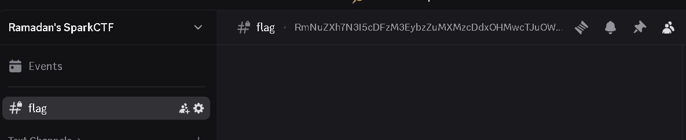
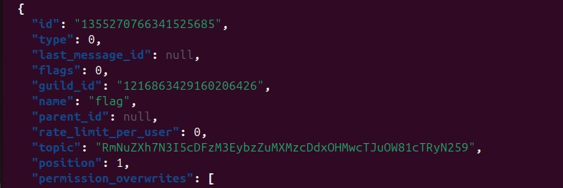

# Solver


# Challenge Name: Discord

## Category: Misc

## Description
Explore and uncover the ````hidden````  flag.

[VisitDiscord](https://ramadan-ctf.espark.tn)

> **PS : This task doesn't require any bot or Discord commands**

**Author** : sn0_0wyy

---

## Approach
The flag is in the topic of a hidden discord channel .



There are 2 ways to solve this the first is by installing a BetterDiscord / Vencord and adding the hidden channel plugin .
That way you can see the channels and their topics but ofc not the messages within .


The second is by using the api provided by discord but first you have to get your discord user token in order to be authenticated:
You have to get the ID of the server first then you use the api after getting your USER TOKEN (I'll tell you how)  

```bash
curl -H "Authorization: USER_TOKEN"
      -H "Content-Type: application/json"      
-X GET "https://discordapp.com/api/v6/guilds/1216863429160206426/channels" | jq | grep "flag"
```
Since the channel is new you'll likely find it at the bottom of that json response .





Follow this repo to get your discord TOKEN based on your browser mine was firefox so I used this inside the console :

```
(webpackChunkdiscord_app.push([[''],{},e=>{m=[];for(let c in e.c)m.push(e.c[c])}]),m).find(m=>m?.exports?.default?.getToken!==void 0).exports.default.getToken()
```


[Obtaining_USER_TOKEN](https://github.com/Tyrrrz/DiscordChatExporter/blob/master/.docs/Token-and-IDs.md)


**Flag Encrypted** : **RmNuZXh7N3I5cDFzM3EybzZuMXMzcDdxOHMwcTJuOW81cTRyN259**


Take the encrypted flag to cyberchef : From Base64 --> ROT13 --> and there you have it !!!


**Flag** : **Spark{7e9c1f3d2b6a1f3c7d8f0d2a9b5d4e7a}**
